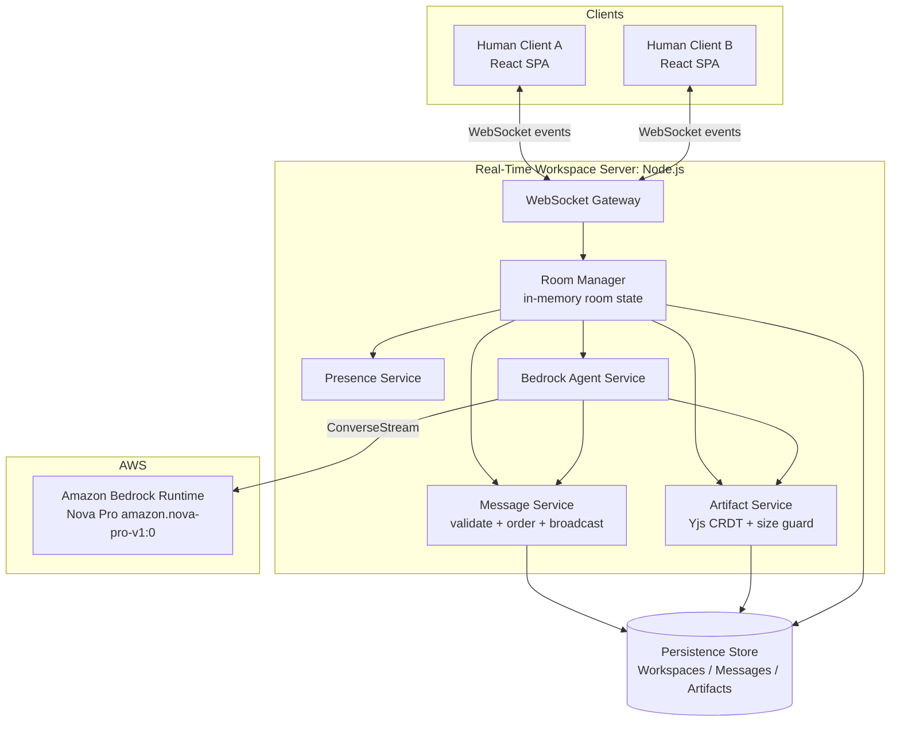
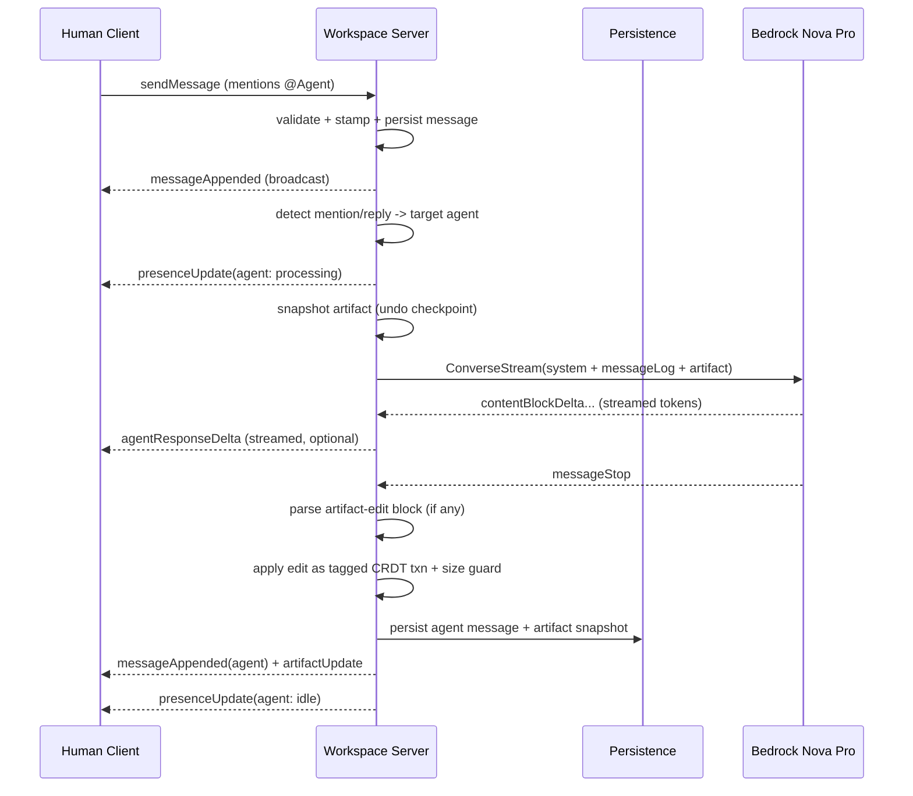

# Design Document

## Overview

The Multiplayer Agent Workspace is a real-time collaborative application where multiple humans and one or more AI agents share a single room built around a co-edited Artifact and a shared Message_Log. AI teammates run on **Amazon Bedrock using the Amazon Nova Pro model** (`amazon.nova-pro-v1:0`), invoked through the Bedrock Runtime **Converse / ConverseStream** API. The design targets a hackathon-MVP scope: fast real-time collaboration over WebSockets, a shared artifact document that humans and agents co-edit, durable persistence so nothing is lost on reconnect, and Markdown export of the finished work.

Three ideas shape the architecture:

1. **One authoritative server per workspace room.** A stateful WebSocket server holds the live room state (participants, presence, artifact CRDT, message log tail) in memory and is the single ordering authority for messages and edits. This keeps the sub-2-second real-time guarantees simple to reason about and makes ordering (Requirement 3.4) and presence (Requirement 2) deterministic.

2. **Agents are first-class participants, not a side channel.** An Agent_Participant is added to the same participant set as humans, appears in presence, reads the same Message_Log and Artifact, writes back to both, and is subject to the same validation and persistence rules. The only differences are the visual treatment (Requirements 2.4, 3.6) and that its "typing" is a Bedrock inference call.

3. **Conflict-free artifact editing via a CRDT.** The Artifact text is a Yjs `Y.Text` CRDT. Every committed edit — human or agent — is a CRDT operation, so concurrent edits converge without losing any committed change (Requirement 6.7). Agent edits are applied inside a tagged transaction so they can be cleanly rolled back on failure (Requirement 5.4) without discarding concurrent human edits.

### Research Notes: Amazon Bedrock Nova Pro

- Amazon Nova Pro is invoked on Bedrock Runtime with model id `amazon.nova-pro-v1:0` (a cross-region inference profile such as `us.amazon.nova-pro-v1:0` may be required depending on region). Source: [Amazon Bedrock Nova Pro model card](https://docs.aws.amazon.com/bedrock/latest/userguide/model-card-amazon-nova-pro.html).
- The **Converse API** (`Converse`) and its streaming variant (`ConverseStream`) provide a single message-based interface across Bedrock models, taking a `system` prompt, a `messages` array of `{ role: "user" | "assistant", content: [{ text }] }`, and an `inferenceConfig` (`maxTokens`, `temperature`, `topP`). Source: [ConverseStream reference](https://docs.aws.amazon.com/botocore/latest/reference/services/bedrock-runtime/client/converse_stream.html) and [Nova streaming responses](https://docs.aws.amazon.com/nova/latest/nova2-userguide/streaming-responses.html).
- ConverseStream emits incremental `contentBlockDelta` events, which lets the server append the agent's response into the Message_Log progressively for a live "teammate is typing" experience.

Content above was rephrased from AWS documentation for compliance with licensing restrictions.

## Architecture

The system has four logical parts: a **Client SPA**, a **Real-Time Workspace Server**, a **Persistence Store**, and the **Bedrock Agent Service** (a server-side module that talks to Amazon Bedrock).



### Component responsibilities

- **Client SPA (React + TypeScript).** Renders presence, the message log, the artifact editor, and export controls. Holds a local Yjs document that syncs with the server over WebSocket. Distinguishes agent vs human presence and messages visually. Sends user intents (join, message, edit, add/remove agent, mention agent, export).
- **WebSocket Gateway.** Accepts connections, authenticates the session to a workspace, and routes typed events to services. It is the transport boundary; all inbound event payloads are treated as untrusted and validated before use.
- **Room Manager.** Owns the in-memory state for each active workspace: participant set, presence map, the authoritative `Y.Doc`, and a message sequence counter. Serializes state-changing operations per room so ordering is well-defined.
- **Message Service.** Validates message content (Requirement 3.1/3.2), assigns `timestamp` + monotonic `sequence`, persists, then broadcasts.
- **Artifact Service.** Applies CRDT updates, enforces the 100,000-character limit (Requirement 6.5), records last-editor metadata, persists, and broadcasts artifact updates.
- **Presence Service.** Tracks join/leave/disconnect and processing state, broadcasts presence and active-count changes with the required timing.
- **Bedrock Agent Service.** Assembles context (message log + artifact), calls Nova Pro via ConverseStream, streams the response into the message log, parses and applies proposed artifact edits, and handles timeout/failure rollback.
- **Persistence Store.** Durable storage for workspaces, participants, messages, and artifact snapshots. MVP default: SQLite (via `better-sqlite3`) behind a `WorkspaceStore` interface; the same interface can be backed by DynamoDB for a hosted deployment.

### Real-time synchronization approach

All real-time behavior flows over a single WebSocket connection per session using a typed event envelope `{ type, workspaceId, payload }`.

**Presence** is server-tracked. On join the server registers the participant and broadcasts `presenceUpdate` + `participantCountUpdate`. Graceful `leave` removes presence immediately; unexpected disconnects are detected by heartbeat ping/pong and reaped (grace window under 30s, Requirement 2.3). Agents carry a `presenceState` of `idle | processing` so the "generating" indicator (Requirement 5.3) is just a presence broadcast.

**Messaging** is server-ordered. The client sends `sendMessage`; the Message Service validates, stamps `timestamp` (ms) and `sequence`, persists, then broadcasts `messageAppended` to all active sessions. Clients render strictly by `(timestamp, sequence)`.

**Artifact sync** uses Yjs. Clients send incremental Yjs updates as `artifactUpdate`; the Artifact Service applies them to the authoritative `Y.Doc`, checks the resulting length, persists a snapshot, and rebroadcasts the update to the other clients. Because Yjs updates are commutative and idempotent, concurrent human/agent edits converge and no committed edit is dropped.

### Agent invocation flow



Key rules embedded in this flow:

- **Trigger.** An agent responds when a message names or replies to it (Requirement 5.1). Generation starts within 2s of the triggering message.
- **Context assembly.** The system prompt frames Nova Pro as a named teammate collaborating on an Artifact of a specific `Artifact_Type`. The full Message_Log is mapped to Converse `messages` (agent's own past messages -> `assistant` role, everyone else -> `user` role with a `Sender:` prefix so the model can distinguish speakers), and the current Artifact content is embedded in the system prompt.
- **Proposed edits.** The prompt instructs the agent to optionally emit a single fenced ` ```artifact ... ``` ` block containing the full proposed artifact content. The server extracts it, diffs against current content, and applies it as a Yjs transaction tagged with `origin = agentId`.
- **Timeout.** A 60s timer (Requirement 5.5) wraps the ConverseStream; on expiry the stream is aborted and treated as a failure.
- **Failure / rollback.** On any failure (Bedrock error, timeout, malformed edit), the server appends an error message attributed to the agent and reverts the artifact to the pre-generation snapshot by undoing only the `agentId`-tagged transaction (via a `Y.UndoManager` scoped to that origin), leaving concurrent human edits intact (Requirements 5.4, 5.5).

### Concurrent editing strategy

The Artifact is a Yjs `Y.Text`. Yjs is a CRDT: edits are represented as operations that merge deterministically regardless of arrival order, and every applied (committed) operation is retained. This directly satisfies Requirement 6.7 — "preserve every committed edit" — because CRDT merge never discards a committed operation; it only orders/positions concurrent inserts.

- **Humans** edit locally; their editor emits Yjs updates streamed to the server and fanned out to peers.
- **Agents** apply their proposed content as a computed diff (insert/delete ops) inside a transaction tagged with the agent's id.
- **Size guard** is evaluated on the *resulting* document length after applying an incoming update; if it would exceed 100,000 characters the update is rejected and not applied, preserving prior content (Requirements 6.3–6.5).
- **Rollback granularity** uses transaction origins so an agent failure reverts only the agent's ops.

### Export to Markdown

Artifact content is authored/stored as Markdown text (the artifact editor is a Markdown-capable text surface). Export therefore is: read the current artifact content string, verify it contains at least one non-whitespace character (Requirement 7.4), wrap it with a small header derived from `Artifact_Type` and workspace metadata, and return it as a downloadable `.md` blob / copyable string. The export is a pure transform over the current content, guaranteeing the full content is included with nothing truncated (Requirement 7.3).

### Technology choices

- **Client:** React + TypeScript, `yjs` + `y-websocket`-style provider (custom-tuned), a Markdown editor component.
- **Server:** Node.js + TypeScript, `ws` for WebSockets, `yjs` for the CRDT, `@aws-sdk/client-bedrock-runtime` for `ConverseStreamCommand`.
- **Persistence:** SQLite (`better-sqlite3`) behind a `WorkspaceStore` interface for the MVP; swappable for DynamoDB.
- **AI:** Amazon Bedrock Runtime, model `amazon.nova-pro-v1:0`, via Converse/ConverseStream.

## Components and Interfaces

### WebSocket event contract

Envelope: `{ type: string; workspaceId: string; payload: object }`.

**Client → Server**

| Type | Payload | Purpose |
|------|---------|---------|
| `join` | `{ joinReference, displayName }` | Join/reconnect to a workspace |
| `sendMessage` | `{ content }` | Post a chat message |
| `artifactUpdate` | `{ yjsUpdate }` (base64) | Commit a CRDT edit |
| `addAgent` | `{ displayName, persona? }` | Add an Agent_Participant |
| `removeAgent` | `{ agentId }` | Remove an Agent_Participant |
| `leave` | `{}` | Graceful session end |
| `export` | `{}` | Request Markdown export |

**Server → Client**

| Type | Payload | Purpose |
|------|---------|---------|
| `workspaceSnapshot` | `{ workspace, participants, artifact, messages }` | Full state on join/rejoin |
| `presenceUpdate` | `{ participantId, presenceState, participantType }` | Presence change |
| `participantCountUpdate` | `{ activeCount }` | Active participant count |
| `messageAppended` | `{ message }` | New message delivered |
| `messageRejected` | `{ reason }` | Validation/persistence rejection |
| `artifactUpdate` | `{ yjsUpdate, lastEditorId, lastEditedAt }` | CRDT edit to apply |
| `artifactRejected` | `{ reason }` | Size-limit/persistence rejection |
| `agentResponseDelta` | `{ agentId, textDelta }` | Streamed token (optional live view) |
| `agentAdded` / `agentRemoved` | `{ participant }` / `{ agentId }` | Roster change |
| `exportReady` | `{ filename, markdown }` | Export payload |
| `error` | `{ code, message }` | Operation error |

### Server service interfaces (TypeScript)

```typescript
interface WorkspaceStore {
  createWorkspace(w: Workspace): Promise<void>;
  getWorkspaceByJoinRef(ref: string): Promise<Workspace | null>;
  workspaceExists(id: string): Promise<boolean>;
  appendMessage(m: Message): Promise<void>;          // durable append
  loadMessages(workspaceId: string): Promise<Message[]>;
  saveArtifactSnapshot(a: ArtifactSnapshot): Promise<void>;
  loadArtifact(workspaceId: string): Promise<ArtifactSnapshot | null>;
  upsertParticipant(workspaceId: string, p: Participant): Promise<void>;
  removeParticipant(workspaceId: string, participantId: string): Promise<void>;
}

interface MessageService {
  // Returns the stamped message on success, or a rejection reason.
  submit(workspaceId: string, senderId: string, content: string):
    Promise<{ ok: true; message: Message } | { ok: false; reason: MessageRejection }>;
}

interface ArtifactService {
  applyUpdate(workspaceId: string, update: Uint8Array, editorId: string):
    Promise<{ ok: true; length: number } | { ok: false; reason: 'SIZE_LIMIT' | 'PERSIST_FAILED' }>;
  getContent(workspaceId: string): string;
  snapshotOrigin(workspaceId: string, origin: string): void;   // checkpoint for rollback
  rollbackOrigin(workspaceId: string, origin: string): void;   // undo only origin's ops
}

interface BedrockAgentService {
  generate(input: AgentGenerationInput): Promise<AgentGenerationResult>;
}

interface AgentGenerationInput {
  agent: Participant;              // agent identity + persona
  artifactType: ArtifactType;
  artifactContent: string;
  messageLog: Message[];           // complete log as context
}

type AgentGenerationResult =
  | { ok: true; responseText: string; proposedArtifact?: string }
  | { ok: false; failure: 'TIMEOUT' | 'MODEL_ERROR' | 'PARSE_ERROR' };

interface ExportService {
  export(workspaceId: string):
    { ok: true; filename: string; markdown: string } | { ok: false; reason: 'EMPTY' | 'FAILED' };
}
```

### Bedrock Agent Service internals

```typescript
// Maps the workspace message log into Converse messages and calls Nova Pro.
async function generate(input: AgentGenerationInput): Promise<AgentGenerationResult> {
  const system = [{ text: buildSystemPrompt(input.agent, input.artifactType, input.artifactContent) }];
  const messages = mapLogToConverseMessages(input.messageLog, input.agent.id);

  const command = new ConverseStreamCommand({
    modelId: "amazon.nova-pro-v1:0",
    system,
    messages,
    inferenceConfig: { maxTokens: 1024, temperature: 0.7, topP: 0.9 },
  });
  // Wrapped in a 60s AbortController (Requirement 5.5).
  // Accumulate contentBlockDelta text, emit agentResponseDelta events,
  // then parse an optional ```artifact ...``` block into proposedArtifact.
}
```

`mapLogToConverseMessages` maps each message to `assistant` when authored by this agent, otherwise `user`, prefixing non-agent content with the sender's display name so Nova Pro can attribute speakers. Consecutive same-role messages are merged to satisfy Converse's alternating-role expectations.

## Data Models

```typescript
type ParticipantType = "human" | "agent";
type PresenceState = "active" | "processing" | "disconnected";
type ArtifactType = "plan" | "PRD" | "issue" | "workflow" | "pitch" | "checklist";
type MessageKind = "chat" | "agent" | "error";

interface Workspace {
  id: string;                 // unique across all workspaces
  joinReference: string;      // shareable ref resolving to id
  ownerId: string;            // Human_Participant id
  artifactId: string;
  createdAt: number;          // epoch ms
}

interface Participant {
  id: string;
  workspaceId: string;
  type: ParticipantType;
  displayName: string;
  joinedAt: number;
  presenceState: PresenceState;
  // agent-only:
  persona?: string;
  modelId?: string;           // "amazon.nova-pro-v1:0"
}

interface Message {
  id: string;
  workspaceId: string;
  senderId: string;
  senderType: ParticipantType;
  senderName: string;
  content: string;            // 1..4000 non-whitespace-bearing chars
  timestamp: number;          // epoch ms, millisecond precision
  sequence: number;           // monotonic per-workspace tiebreaker
  kind: MessageKind;
}

interface ArtifactSnapshot {
  id: string;
  workspaceId: string;
  artifactType: ArtifactType;
  content: string;            // Markdown text, <= 100000 chars
  lastEditorId: string | null;
  lastEditedAt: number | null;
  yjsState: Uint8Array;       // encoded Y.Doc state for durable CRDT restore
}
```

**Constraints and invariants**

- `Workspace.id` and `joinReference` are unique; `joinReference` resolves to exactly one `id`.
- A workspace has at most 5 agent participants (Requirement 4.1/4.5).
- `Message.content` length in `[1, 4000]` and contains ≥1 non-whitespace character; otherwise it is never persisted or logged.
- Messages within a workspace are totally ordered by `(timestamp, sequence)`; `sequence` is strictly increasing per workspace.
- `ArtifactSnapshot.content` length ≤ 100,000; the type is always one of the six valid `ArtifactType` values (defaulting to `"plan"`).
- Every applied artifact change updates `lastEditorId` and `lastEditedAt`.

## Correctness Properties

*A property is a characteristic or behavior that should hold true across all valid executions of a system — essentially, a formal statement about what the system should do. Properties serve as the bridge between human-readable specifications and machine-verifiable correctness guarantees.*

The following properties were derived from the acceptance criteria via the prework analysis. Redundant criteria were consolidated (e.g., human and agent edit application share one property; message/artifact durability is validated by a single persist-then-rejoin round trip; presence join/leave/count share one consistency property).

### Property 1: Workspace creation produces unique identifiers and correct ownership

*For any* sequence of workspace-creation requests, all resulting workspace identifiers are pairwise distinct and each created workspace records its requester as the Owner.

**Validates: Requirements 1.1**

### Property 2: Join reference round-trip

*For any* created workspace, resolving its generated join reference returns exactly that workspace's identifier.

**Validates: Requirements 1.3**

### Property 3: Join membership is idempotent

*For any* workspace and any human participant, joining via a valid reference results in that participant being a member exactly once; joining again when already a member leaves the participant set unchanged (no duplicate entry).

**Validates: Requirements 1.4, 1.5**

### Property 4: Join snapshot reflects current state

*For any* workspace state, the snapshot delivered on join equals the current artifact content and the complete message log ordered by ascending timestamp with ties broken by append sequence.

**Validates: Requirements 1.7, 8.5**

### Property 5: Presence and active count are consistent with the active set

*For any* sequence of joins and leaves, the presence set and reported active-participant count observed by every remaining participant equal the set of currently active participants (a graceful leave removes the participant; a join adds it).

**Validates: Requirements 2.1, 2.2, 2.5, 4.2**

### Property 6: Valid messages are appended with identity and millisecond timestamp

*For any* message whose content contains at least one non-whitespace character and at most 4000 characters, the system appends exactly one message to the log carrying the sender's identity and a millisecond-precision timestamp, and that message is delivered to all active participants.

**Validates: Requirements 3.1, 3.3, 3.5**

### Property 7: Invalid messages are rejected

*For any* message content that is empty, consists only of whitespace, or exceeds 4000 characters, the system rejects it, leaves the message log unchanged, and returns a rejection error.

**Validates: Requirements 3.2**

### Property 8: Message display order is total by (timestamp, sequence)

*For any* set of messages in a workspace, the order presented to participants equals sorting by ascending timestamp with ties broken by ascending append sequence.

**Validates: Requirements 3.4**

### Property 9: Agent capacity is capped at five

*For any* sequence of add-agent requests against a workspace, the number of agent participants never exceeds five, and any add request issued while five agents are present is rejected with an error and adds no participant.

**Validates: Requirements 4.1, 4.5**

### Property 10: Agent add/remove round-trip

*For any* workspace with fewer than five agents, adding an agent and then removing it returns the participant set and agent count to their prior values; removing an agent that is not a participant is rejected with an error and leaves the roster unchanged.

**Validates: Requirements 4.1, 4.4, 4.6**

### Property 11: Agent context is complete and correctly targeted

*For any* message that names or replies to a specific agent, the system triggers generation for that agent, and the context assembled for the Bedrock invocation includes the complete message log and the current artifact content.

**Validates: Requirements 4.3, 5.1**

### Property 12: Successful agent generation appends one attributed response

*For any* successful agent generation, the message log gains exactly one message attributed to that agent, and the agent's presence is shown as processing during generation and reverts afterward.

**Validates: Requirements 5.2, 5.3**

### Property 13: Failed agent generation rolls back its artifact changes and preserves human edits

*For any* pre-generation artifact content and any set of concurrent human edits, when an agent generation fails the system appends an error message attributed to that agent and reverts only the agent's artifact changes, restoring the artifact to the pre-generation content while preserving all concurrent committed human edits.

**Validates: Requirements 5.4, 5.5**

### Property 14: Valid-size edits are applied regardless of author

*For any* edit — submitted by a human or proposed by an agent — that results in artifact content of at most 100,000 characters, the system applies the edit, reflects it in the artifact content, records the editing participant's identity and the change timestamp, and delivers the updated content to all active participants.

**Validates: Requirements 6.3, 6.4, 6.6**

### Property 15: Artifact size limit is never exceeded

*For any* edit or change that would result in artifact content exceeding 100,000 characters, the system rejects it, preserves the existing content, and returns a limit error; consequently the stored artifact content length never exceeds 100,000 characters.

**Validates: Requirements 6.5**

### Property 16: Artifact initialization uses a valid type

*For any* workspace-creation request, the initialized artifact has empty content and an artifact type equal to the Owner-selected type when it is one of {plan, PRD, issue, workflow, pitch, checklist}, and equal to "plan" otherwise.

**Validates: Requirements 6.1, 6.2**

### Property 17: Concurrent edits converge and preserve every committed edit

*For any* set of concurrent artifact edits applied in any interleaving across replicas, all replicas converge to the same content and that content contains every committed edit (no committed edit is lost).

**Validates: Requirements 6.7**

### Property 18: Export contains the complete artifact content

*For any* artifact whose content contains at least one non-whitespace character, the exported Markdown representation contains the full current content verbatim with nothing omitted or truncated (the artifact body extracted from the export equals the original content).

**Validates: Requirements 7.1, 7.3**

### Property 19: Empty artifact export is refused

*For any* artifact whose content is empty or consists only of whitespace, an export request produces no export representation and returns an "artifact is empty" message.

**Validates: Requirements 7.4**

### Property 20: Persistence round-trip restores full state

*For any* workspace state (artifact content plus message log) that has been persisted, rejoining the workspace restores identical artifact content and the complete message log in (timestamp, sequence) order.

**Validates: Requirements 8.1, 8.3, 8.5**

### Property 21: Persistence failure is transactional

*For any* message append or artifact update whose durable persistence fails, the system rejects the operation, retains the last successfully persisted state (the message is excluded from the log; the artifact reverts to its last persisted content), never broadcasts the failed change, and returns a save error.

**Validates: Requirements 8.2, 8.4**

## Error Handling

Errors are handled at the boundary where they occur and surfaced to the responsible participant, never silently swallowed.

- **Workspace creation failure (1.2).** If the store cannot create the workspace, no workspace row and no owner are written (single transactional insert), and an `error` event with code `WORKSPACE_CREATE_FAILED` is returned to the requester.
- **Invalid / unknown join reference (1.6).** Resolution returns null; the server responds with `error` code `WORKSPACE_NOT_FOUND` and adds no participant.
- **Message validation (3.2).** Validation runs before any state change; rejected messages produce `messageRejected` with a reason (`EMPTY`, `WHITESPACE_ONLY`, `TOO_LONG`) and never touch the log.
- **Persist-before-broadcast (8.2, 8.4).** Messages and artifact snapshots are persisted first; only on success are they added to in-memory state and broadcast. On persistence failure the in-memory state is rolled back (artifact reverts to last persisted `yjsState`) and a `messageRejected` / `artifactRejected` error is returned to the author.
- **Artifact size limit (6.5).** The resulting length is checked after computing the merged document but before commit; over-limit updates are discarded and `artifactRejected` code `SIZE_LIMIT` is returned.
- **Agent capacity (4.5) and unknown agent removal (4.6).** Guarded with explicit checks returning `AGENT_LIMIT_REACHED` / `AGENT_NOT_FOUND`.
- **Bedrock failures and timeouts (5.4, 5.5).** All ConverseStream calls are wrapped in a 60s `AbortController` and try/catch. Any of: SDK/model error, timeout, or a malformed/unparseable artifact-edit block results in the failure path: append an agent-attributed error message, roll back the agent's tagged CRDT transaction, and set the agent presence back to idle. Bedrock throttling (`ThrottlingException`) is treated as a failure for the MVP (no retry storm); a single short backoff retry may be added later.
- **Export failure (7.5) and empty export (7.4).** Empty/whitespace content returns `EXPORT_EMPTY` with a message and produces nothing; unexpected failures return `EXPORT_FAILED` and leave the artifact untouched.
- **Untrusted input.** All inbound WebSocket payloads are schema-validated; malformed envelopes are dropped with an `error` response and do not mutate room state.

## Testing Strategy

The feature is well suited to property-based testing: message validation/ordering, ID uniqueness, artifact size limits, CRDT convergence, export completeness, and persistence round-trips are pure-logic behaviors with large input spaces. Bedrock calls, WebSocket timing windows, and UI visual treatments are covered by example/integration tests instead.

### Property-based tests

- **Library:** `fast-check` with the Vitest test runner (TypeScript server code).
- **Iterations:** each property test runs a minimum of **100 iterations**.
- **Coverage:** implement each of Properties 1–21 above as a **single** property-based test.
- **Tagging:** every property test is tagged with a comment of the form
  `// Feature: multiplayer-agent-workspace, Property {number}: {property_text}`.
- **Isolation for external dependencies:** the Bedrock Agent Service is exercised through a mock `BedrockAgentService` (and a fake ConverseStream) so agent-flow properties (11, 12, 13) test our orchestration and rollback logic without live model calls. Persistence properties (20, 21) use an in-memory `WorkspaceStore` plus a failure-injecting decorator.
- **Generators:** custom generators for message content (including whitespace-only and 4001+ char edge cases), artifact contents up to and beyond 100,000 chars, artifact-type values (valid and invalid), sequences of join/leave events, and sequences/interleavings of CRDT edit operations.

### Example and edge-case unit tests

- Workspace creation failure path (1.2), invalid join reference (1.6).
- Unexpected-disconnect presence reaping using a mock clock past the 30s window (2.3).
- Agent generation 60s timeout using a mock slow stream and mock clock (5.5).
- Export delivery payload shape (7.2) and export failure path (7.5).
- Remove-nonexistent-agent error (4.6) as a concrete case complementing Property 10.

### Integration tests (1–3 examples each, not PBT)

- **Bedrock Nova Pro end-to-end:** one live/`ConverseStream`-recorded test that a mention triggers a Nova Pro (`amazon.nova-pro-v1:0`) call and the streamed response is appended to the log. Verifies wiring, model id, and the Converse message mapping — behavior that does not vary meaningfully with input.
- **WebSocket real-time flow:** two clients join, exchange a message, and both observe presence and message delivery.
- **Persistence backend:** SQLite `WorkspaceStore` round-trip against a real database file.

### UI tests

- Snapshot/component tests asserting agent vs human **presence markers** (2.4) and agent vs human **message treatment** (3.6) render distinctly.
