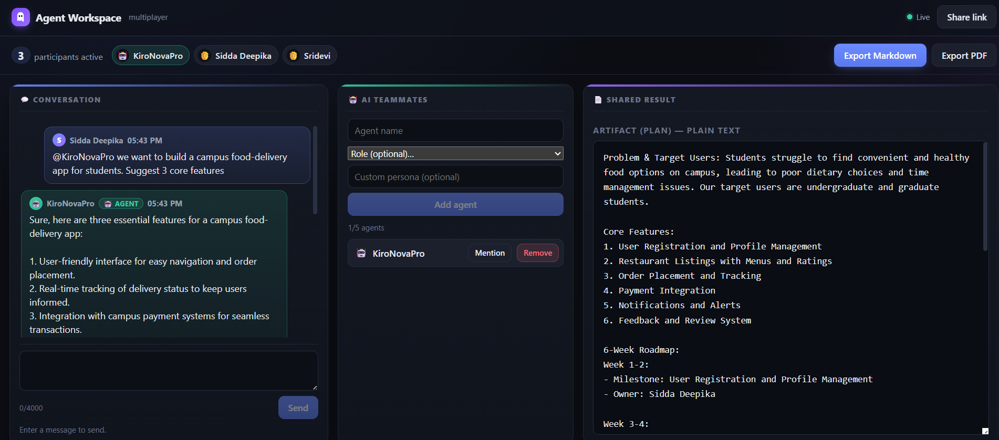

# Multiplayer Agent Workspace

A real-time collaborative room where **people and AI teammates work together** and leave with a finished, exportable result. Open a shared workspace, invite an AI teammate, think through an idea in chat, shape a shared result together, and export it as **PDF** or **Markdown**.

Unlike a normal chatbot, the AI is a **first-class participant**: it joins the same room, sees the same conversation and shared content, and contributes directly alongside everyone else.


> **Live demo (join directly):** http://13.220.41.228/#7b62331d-5653-42c6-9022-73cffae8ea5c — just enter a name to join the shared workspace.

---

## Highlights

- **Real-time multiplayer** — several people join the same room over WebSockets; presence and chat stay in sync within seconds.
- **AI teammates** — add an agent powered by **Amazon Bedrock — Nova Pro** (`amazon.nova-pro-v1:0`), give it a role (Product Manager, Engineer, Designer, Critic, Researcher), and `@mention` it. It answers with the full context of the room.
- **Shared result, co-created live** — humans and agents build one shared result together (a Yjs CRDT), so simultaneous edits merge without losing anyone's work. A **Keep / Revert** banner appears when an agent contributes.
- **Chat vs. result, kept separate** — questions and brainstorming stay in chat; explicit "write / update" requests shape the shared result.
- **Save to history & Clear** — snapshot the current result into your own durable history (stored server-side, private to you and keyed to your participant id), clear the panel so the agent's next answer starts fresh, and restore any past version later.
- **Export** — download the final result as **PDF** or **Markdown**.
- **Durable by default** — everything (participants, chat, shared result) persists in **DynamoDB**. Messages are keyed by a unique id with a no-overwrite write guard, so history is never lost across reconnects, restarts, or redeploys.
- **Easy invites & auto-rejoin** — share one link; invitees just enter a name to join, and a refresh rejoins them automatically as the same participant (no duplicates).
- **Plain-text results** — agents write the shared result in clean plain text (no stray Markdown), so it reads and exports cleanly.

## How it works (at a glance)

There are two areas in a workspace:

- **Chat** — the conversation between people and AI teammates (discussion, questions, coordination).
- **Shared result** — the thing you're actually building together, and what you export at the end.

Say things like *"suggest…"* or *"what do you think"* to keep it in chat. Say *"write…"*, *"update it"*, or *"replace it with…"* to have the agent shape the shared result.

At the top of the shared result you can **Save to history** (keep the current version), **Clear** (start a fresh result), and open **History** to preview, restore, or delete past versions. Finish by exporting to **PDF** or **Markdown**.

## Screenshots

People and an AI teammate collaborating in a shared workspace — chat on the left, AI teammates in the middle, and the shared result on the right:



## Architecture

- **`shared/`** — TypeScript domain types, constants, and the WebSocket event contract.
- **`server/`** — Node.js + TypeScript. WebSocket gateway, per-room manager, and services for messaging, presence, the shared-content CRDT (Yjs), export, and the Bedrock agent. Pluggable persistence via a `WorkspaceStore` interface with two backends: **DynamoDB** (default in production) and **SQLite** (local/dev).
- **`client/`** — React + TypeScript single-page app. Presence, chat, a live shared-content editor bound to a local Yjs doc, agent management, and PDF/Markdown export.

```
Browser (React SPA)  <-- WebSocket -->  Node server (rooms, presence, CRDT, agent)
                                              |                       |
                                        DynamoDB / SQLite        Amazon Bedrock (Nova Pro)
```

## Prerequisites

- Node.js 18+ and npm
- (Optional, for the AI teammate) AWS credentials with Amazon Bedrock access to `amazon.nova-pro-v1:0`

## Setup

```bash
npm install
cp .env.example .env      # Windows: copy .env.example .env
npm run build
```

Set `AWS_REGION` in `.env` to enable the AI teammate. Without it the app still runs; `@mentioning` an agent just won't call a model.

## Run locally

```bash
# Terminal 1 — server (HTTP + WebSocket on :8787), SQLite by default
npm run start -w @maw/server

# Terminal 2 — client dev server
npm run dev -w @maw/client
```

Then:

1. Enter a display name, pick a result type, and **Create workspace**.
2. Add an AI teammate (e.g. `Nova`) and send `@Nova write a plan for ...`.
3. Watch it reply in chat and shape the shared result; edit it together.
4. **Share link** (top bar) to bring in a second person/browser.
5. **Export PDF** or **Export Markdown** for the final output.

## Persistence backends

The server selects a store via the `STORE` env var:

| `STORE`  | Backend  | Notes |
|----------|----------|-------|
| `dynamo` | DynamoDB | Managed and durable; used in production. Single table (`MAW_DYNAMO_TABLE`, default `maw`) with a `GSI1` index for join-reference lookups. |
| `sqlite` | SQLite   | Default for local/dev. File at `DB_PATH` (default `maw.db`). |

## Testing

```bash
npm test          # all packages
npm run typecheck # type-check all packages
```

The suite includes **21 property-based tests** (fast-check, ≥100 iterations each) covering message validation/ordering, ID uniqueness, size limits, CRDT convergence, agent orchestration/rollback, export completeness, and persistence round-trips — plus example and UI tests. Current totals: **193 server tests** and **50 client tests**.

## Environment variables

See [`.env.example`](./.env.example). Key variables:

| Variable | Scope | Purpose |
|---|---|---|
| `PORT` | server | HTTP/WebSocket port (default `8787`) |
| `STORE` | server | `dynamo` or `sqlite` (default `sqlite`) |
| `MAW_DYNAMO_TABLE` / `MAW_DYNAMO_REGION` | server | DynamoDB table and region when `STORE=dynamo` |
| `DB_PATH` | server | SQLite file path when `STORE=sqlite` (default `maw.db`) |
| `AWS_REGION` / `BEDROCK_REGION` | server | Enables the Nova Pro agent when set |
| `AWS_ACCESS_KEY_ID` / `AWS_SECRET_ACCESS_KEY` / `AWS_PROFILE` | server | AWS credentials (standard SDK provider chain; the EC2 IAM role is used in production) |
| `VITE_SERVER_HTTP` / `VITE_SERVER_WS` | client | Override the server URLs if not same-origin |

No real secrets are committed; `.env` is git-ignored.

## Deployment

Pushes to `main` auto-deploy to EC2 via GitHub Actions (`.github/workflows/deploy.yml`): build the Docker image, restart the container, and health-check `/health`. The container runs with `STORE=dynamo`, and the EC2 instance role grants Bedrock + DynamoDB access.

## How Kiro was used

This project was built with **Kiro's spec-driven workflow**, not one-shot prompting. Starting from a rough idea, Kiro guided it through three reviewed artifacts under `.kiro/specs/multiplayer-agent-workspace/`: a **requirements** document (EARS-style acceptance criteria across 8 requirements), a **design** document (architecture, component interfaces, data models, and 21 formal correctness properties), and a dependency-ordered **tasks** list.

Implementation ran as **agentic, spec-driven task execution**: Kiro worked through the task list wave by wave, delegating each task to a focused sub-agent that wrote the code and then ran the build and tests before moving on. A core principle was **property-based testing** — the design fixed executable correctness properties (e.g. "concurrent edits converge and preserve every committed edit," "size limit is never exceeded," "persistence failure is transactional"), each implemented as a fast-check property running ≥100 iterations. This caught edge cases example tests miss and gave objective evidence the system meets its spec.

Kiro also handled the "last mile" iteratively: wiring runnable entrypoints, fixing a duplicate-participant bug, adding a smooth invite/rejoin flow, switching persistence to DynamoDB, adding PDF export, keeping the agent's chat reply separate from the shared result, and rehydrating agents after restarts — each change validated and deployed. Treating the specs and correctness properties as the source of truth kept the loop reliable rather than ad hoc.
